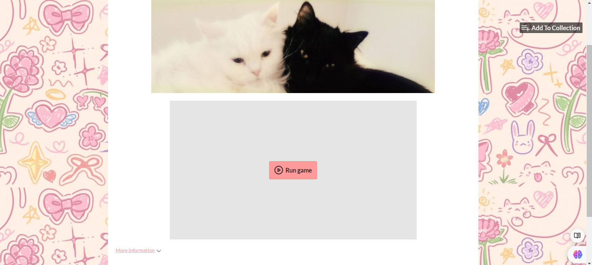
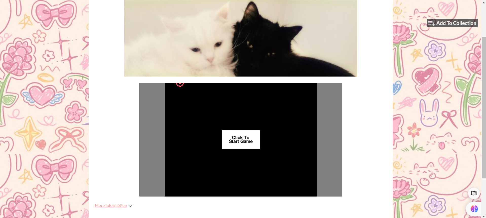
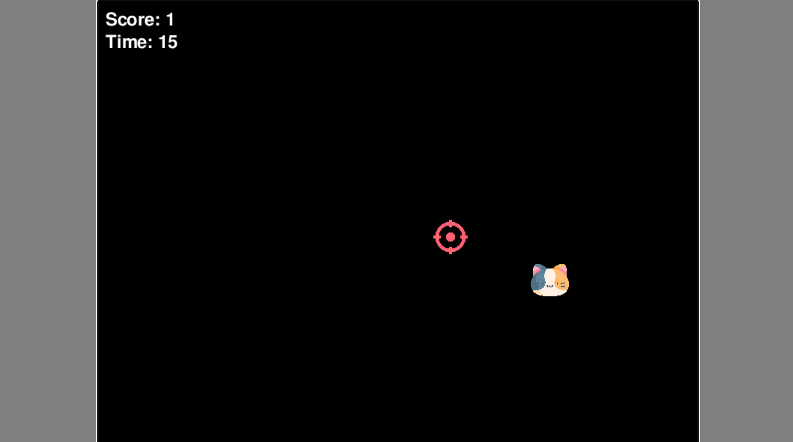
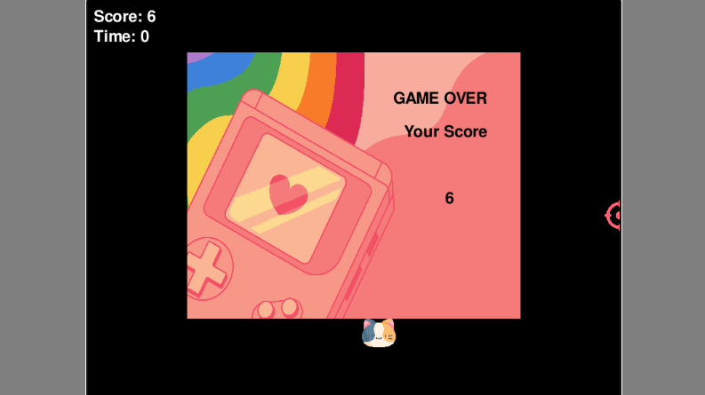

  

# Aim Trainer
Welcome to Aim Trainer, a simple yet engaging game designed to help improve your aiming skills! This project is built using Python and click here to open [Cat Aim Trainer](https://oishylea.itch.io/cat-aim-trainer)

## Game Overview
In Aim Trainer, players have 20 seconds to click on a moving target (a cat!). The objective is to score as many points as possible by clicking the target before the time runs out. After the game ends, your score will be displayed, allowing you to track your progress and improvement.

## Features
- Simple and intuitive gameplay
- Engaging target (cat) for players to aim at
- Score display at the end of each game session
- Built using Python for easy customization and enhancement

## How to Play

1. Start the game on [itch.io](https://oishylea.itch.io/cat-aim-trainer).
2. Click on the cat target as quickly as possible within the time limit.
3. Check your score at the end of the game!

 

Happy aiming!
   
## Game Interface
  

  

  
  

